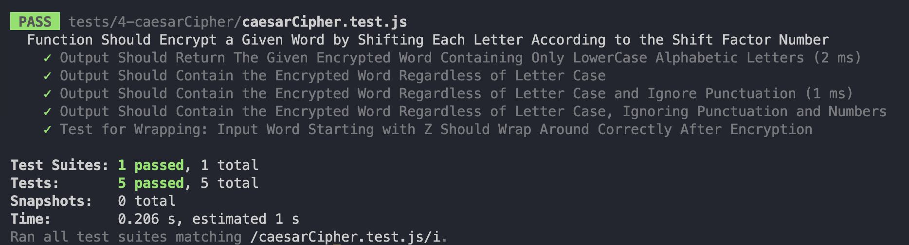

# JavaScript Testing with Jest

This small project focuses on demonstrating how to write tests for various JavaScript functions using the Jest testing framework.

## Table of Contents

- [Introduction](#introduction)
- [Getting Started](#getting-started)
- [Functions and Tests](#functions-and-tests)
  - [1. Capitalize Function](#1-capitalize-function)
  - [2. ReverseString Function](#2-reversestring-function)
  - [3. Calculator Object](#3-calculator-object)
  - [4. CaesarCipher Function](#4-caesarcipher-function)
  - [5. AnalyzeArray Function](#5-analyzearray-function)

## Introduction

Jest is a popular testing framework for JavaScript projects. However, it doesn't natively support ES6 import statements. You must install Babel using a package manager, I have used
npm (node package manager)

## Getting Started

Follow these steps to get started with the project:

1. Clone this repository to your local machine.
2. Install the necessary dependencies using `npm install` if needed.
3. Run the tests using the command `npm test`.

## Functions and Tests

### 1. Capitalize Function

Description: This function takes a string and returns it with the first character capitalized.

Test: The `capitalize` function is tested for various input strings to ensure proper capitalization.

### 2. ReverseString Function

Description: This function takes a string and returns it reversed.

Test: The `reverseString` function is tested with different strings to verify the correct reversal.

### 3. Calculator Object

Description: The `calculator` object contains functions for basic arithmetic operations: add, subtract, divide, and multiply. Each function takes two numbers and returns the calculated result.

Test: Each arithmetic operation is tested for correctness using the `calculator` functions.

### 4. CaesarCipher Function

Description: The `caesarCipher` function takes a string and a shift factor, and returns the string with each character shifted by the given factor.

Test: The `caesarCipher` function is tested for character shifting, including wrapping from 'z' to 'a', maintaining the same case, and handling punctuation.

### 5. AnalyzeArray Function

Description: The `analyzeArray` function takes an array of numbers and returns an object with properties: average, min, max, and length.

Test: The `analyzeArray` function is tested with an array of numbers to ensure precise calculation of average, minimum, maximum, and length.

Feel free to explore the tests and implementations in the `src` directory. 
